

  

<h1 align="center">🚀 OptiChain AI v2.0</h1>
<h3 align="center"> Uçtan Uca Veri Analitiği, Tahmine Dayalı Risk Teşhisi ve Akıllı Satış ve Operasyon Planlaması Karar Destek Ekosistemi</h3>
<h4 align="center">Veri Analitiği - İş Zekası & Veri Bilimi Projesi</h4>

  
  
  
  

  

---

<h2 align="center">📈 1. ÖZET VE İŞ DEĞERİ ÖNERİSİ</h2>

  <b>🌐 Sektörel Problem Tanımı ve Projenin Vizyonu:</b> 
  Modern tedarik zinciri, CRM ve lojistik ağlarında karşılaşılan en büyük operasyonel darboğaz, <b>tahmin edilemeyen sevkiyat gecikmeleri</b>, <b>verimsiz stok-talep dengesizlikleri</b> ve veritabanı seviyesinde kontrol edilemeyen <b>kirli veri akışlarıdır</b>. Zamanında teslim edilemeyen tek bir sipariş müşteri sadakatini (<b>Churn Risk</b>) doğrudan tetiklerken; ambarlarda biriken kontrolsüz atıl stoklar kurumsal elde tutma maliyetlerini (<b>Holding Cost</b>) maksimize etmekte, veri tabanındaki lojistik ve finansal mantık hataları ise makine öğrenmesi modellerinin yanlış öğrenmesine (<b>Garbage In, Garbage Out</b>) yol açmaktadır.
    
  <b>OptiChain AI v2.0;</b> DataCoSupplyChainDataset.csv ham tedarik zinciri ve lojistik veri setini <b>uçtan uca</b> işleyerek detaylı analizler, stratejik tespitler ve operasyon yöneticilerinin ve C-Level karar vericilerin günlük stratejik kararlarını optimize eden, gecikme riskini tespit eden ve
  yapay zeka tabanlı küresel bir <b>S&OP (Satış ve Operasyon Planlama) Karar Destek Sistemidir</b>. 
. Bu ekosistem; (Python ve Postrsql) ile çok aşamalı veri temizliğinden, ileri düzey makro keşifçi veri analizlerine ,(EDA), tespitler, parametrik/non-parametrik <b>A/B Testlerine</b>, müşteri analitiği (<b>RFM, K-Means Kümeleme, CLTV, BG/NBD & Gamma-Gamma</b>) modellerine, <b>100+'den fazla ileri gelişmiş DAX fonksiyonu</b> barındıran kurumsal iş zekası (<b>Power BI</b>) detaylıca 10+ sayfa analiz raporlama katmanına,  PostgreSQL star shema , WİEWLER, mimarisindeki kurumsal veri kalitesi kalkanları(<b>Data Quality Validation Views</b>), risk , segmentasyon analizlerine, ML <b>CatBoost & SHAP</b> tabanlı açıklanabilir makine öğrenmesi (<b>XAI</b>) çıkarım hatlarına ve derin öğrenme (<b>LSTM</b>) satış simülasyonlarına sonra da fast api, cloud, deploy işlemlerine kadar uzanan devasa bir yelpazeyi tek bir çatıda birleştirmektedir.

 

<h2 align="center">🛠️ 2. STRATEJİK KATMANLAR VE ÇÖZÜM KÜMESİ</h2>

  
🎯 <b>Çok Aşamalı Python Veri Temizliği & Tanıma:</b> Ham veri setleri Python (Pandas/NumPy) mimarisiyle detaylıca gürültüden arındırılmış temizlenmiştir, veri tipleri optimize edilmiş ve lojistik iş birimlerinin ihtiyaç duyduğu yeni türetilmiş değişkenler ve makro metrikler boru hattına eklenmiştir.

   
💎 <b>Gelişmiş Analizler(python,postresql,power bı): Genel finansal global Operansyon analiz, Bölgesel Performans, Sezonsallık-Zaman, Lojistlik&Sevkiyat, Risk-Veri kailitesi denetimi, Veri Bütünlüğü Müşteri Kaybı, Müşteri Zekası(RFM-K-MeANS, Customer360), BG-NBD 
   GAMMA (CLTV) tahminleri, Karar Bilimi A/B Testleri, Ml(Sipariş Gecikme)-SHAP, DL(LTSM-Global Satış Hacmı talep tahmin) analiz sayfaları

  
  
💎 <b>Gelişmiş CRM & Müşteri Analitiği (RFM, K-Means & CLTV):</b> Müşteri tabanı kuramsal varsayımlarla değil; Python ile RFM analitiği, K-Means kümeleme algoritması ve BG/NBD & Gamma-Gamma modelleriyle ileri düzey CLTV (Müşteri Yaşam Boyu Değeri) tahminleme süreçlerine tabi tutulmuştur. En kârlı VIP müşteri segmentleri matematiksel olarak izole edilmiştir.

  
  
📊 <b>İstatistiksel Doğrulama (A/B Testing):</b> Dağıtım kanalları, teslimat rotaları ve segment bazlı performans kırılımları rastgele kabullerle değil, parametrik ve non-parametrik hipotez testleriyle (A/B Testleri) matematiksel olarak doğrulanmıştır.

  
  
🛡️ <b>İleri Düzey SQL Veri Kalitesi & Sağlık Kontrolü (Data Governance):</b> PostgreSQL seviyesinde kurulan <code>v_data_quality_alerts</code> görünümüyle 180 bin satırlık kurumsal verinin sağlık kontrolü anlık olarak yapılmaktadır. Finansal, lojistik ve zamanlama mantık hataları sistem tarafından otomatik olarak yakalanıp kategorize edilerek Power BI segment analizlerine hazır hale getirilmiştir.

  
  
🚨 <b>Proaktif Risk Önceliklendirme & Operasyonel Görünüm (SQL Views):</b> Yazılan <code>v_risky_orders</code> view katmanı ile şüpheli işlemler (Fraud), aşırı finansal kayıplar ve VIP gecikme krizleri hiyerarşik olarak risk puanlarına (Priority 1-6) ayrılmış, karar vericilere anlık aksiyon alma gücü sunulmuştur.

  
  
🧠 <b>Açıklanabilir Makine Öğrenmesi (CatBoost & SHAP):</b> Sevkiyatlar henüz ambar kapısından çıkmadan önce gecikme olasılığını hesaplayan bir sınıflandırma modeli entegre edilmiştir. SHAP (XAI) katmanıyla, her bir risk faktörünün karara etkisi operasyonel bazda tamamen şeffaflaştırılmıştır.

  
  
📈 <b>Proaktif Derin Öğrenme Simülasyonları (LSTM):</b> Girilen tarihten 30 gün sonrası için günlük dinamik ciro dalgalanmalarını öngören zaman serisi modeli kurgulanmıştır. Sistem, kampanya şoklarını simüle ederek ambar stoklarının kritik seviyeye düşeceği günü önceden öngörüp proaktif "Tedarik Emirleri" üretmektedir.

  
  
💻 <b>Kurumsal Dağıtım & İş Zekası Katmanı (Power BI, FastAPI & Streamlit):</b> Canlı sistem mimarisi FastAPI backend sunucusuyla izole edilmiş, C-Level yöneticilerin senaryo analizi yapabileceği premium bir Streamlit frontend paneli ve kurumsal Power BI raporlama katmanıyla mühürlenmiştir.

---

<h2 align="center">🔬 3.GELİŞMİŞ ANALİTİK, MAKİNE ÖĞRENİMİ VE İÇGÖRÜ KEŞFİ AŞAMASI (PYTHON)</h2>

  <b>💡 Veri Sızıntısı Yönetimi, Operasyonel Paradokslar ve Proaktif Yapay Zeka Teşhisleri:</b> 
  Modelleme öncesi, sisteme veri sızıntısı (Data Leakage) fısıldayan ve ezberciliğe sürükleyen 29 ölü değişken cerrahi müdahaleyle elenerek veri yönetişimi (Data Governance) tam korumaya alınmıştır. Gelişmiş EDA süreçlerinde sipariş trafiğinin öğle saatlerinde (11.48 ortalama) zirve yaptığı, öğleden sonraya sarkan gönderimlerde vardiya darboğazları nedeniyle gecikme olasılığının sipariş büyüklüğünden bağımsız olarak tırmandığı saptanmıştır. Şirketin ana kâr motoru 102.6 $ ortalama ile <i>Technology</i> departmanı olarak izole edilirken, nakit (CASH) ödemelerin komisyon sızıntılarını keserek en yüksek kârlılığı getirdiği teşhis edilmiştir.
    
  Yürütülen istatistiksel hipotez testleri şirket yönetiminin tüm ezberlerini bozan kritik operasyonel paradoksları tescillemiştir: Kruskal-Wallis testi sonucunda kargo modlarının kârlılık marjları üzerinde anlamlı bir fark yaratmadığı ($p = 0.4600$) kanıtlanırken; Proportions Z-Test ve Mann-Whitney U testlerinin çarpışmasıyla, premium ücret ödenen <b>"First Class" (Hızlı Kargo) teslimatlarının fiziksel olarak 2 kat daha hızlı ulaştığı (2.00 gün) ancak sistemsel planlama (Scheduling) hatası yüzünden kronik olarak %95.32 oranında geciktiği</b> deşifre edilmiştir. Ayrıca Debit Kart onay süreçlerindeki provizyon bekleme sürelerinin lojistik akışı anlamlı derecede yavaşlattığı Z-Test çıktısıyla matematiksel olarak doğrulanmıştır.
    
  Müşteri analitiği bacağında, geçmiş cirolara odaklanan geleneksel yaklaşımlar terk edilerek Python ile RFM, K-Means Kümeleme ve BG/NBD & Gamma-Gamma CLTV modelleri hibrit entegre edilmiştir. Finansal geçmişine bakılarak "Sadık" zannedilen birçok VIP müşterinin aslında sistemdeki lojistik süreçlerden ötürü en çok mağdur edilen <i>(New_High_Risk_Late)</i> grupta yer aldığı saptanarak proaktif churn engelleme kalkanı kurulmuştur.
    
  Gecikmeyi kapıdan çıkmadan yakalamak adına kurgulanan makine öğrenmesi safhasında, 5-Fold Cross Validation ve ağır regülarizasyon altında yarışan modeller arasından <b>CatBoost Classifier (V12)</b> liderliği göğüslemiştir. Lojistikte gecikmeyi kaçırmanın maliyeti yıkıcı olduğu için model bilinçli olarak <b>%71.9 Accuracy, %70.9 Precision, %77.8 F1-Score ve %86.2 Recall (Lojistik Sigortamız!)</b> başarısıyla mühürlenmiştir. Overfitting Gap değerinin sadece 0.0492 olması kusursuz genelleme yeteneğini kanıtlamıştır. Bu kara kutu modelin kararlarını şeffaflaştırmak adına kurulan <b>3 Kriterli SHAP (XAI) motoru</b>, her bir sipariş özelinde gecikmeyi tetikleyen tam 3 kök nedeni anlık çözerek <i>supply_chain_v12_predictions</i> tablosuna işlemiştir.
    
  Geleceğe yönelik proaktif S&OP katmanında, geçmişi ezberleyen geniş pencereler yerine 3 günlük mikro pencerelerle kurgulanan <b>"The Compact Tank" LSTM zaman serisi modeli</b> devreye alınmıştır. Doğrudan ciroyu tahminlemek yerine "Satış Farkını" (Sales Diff) öngörerek %44.43'lük (Train Loss: 0.0638, Val Loss: 0.0921) kusursuz dürüstlük oranına ve 0.6283 $R^2$ skoruna ulaşan bu mekanizma; son 30 günlük test setindeki ciro oynaklığını anlık tarayarak <b>13,856.52 $ dinamik kritik talep eşiğini</b> belirlemekte, yetersiz stok risklerini %95 güven aralığında önceden haber veren akıllı bir S&OP uyarı koridoru üretmektedir.

---

  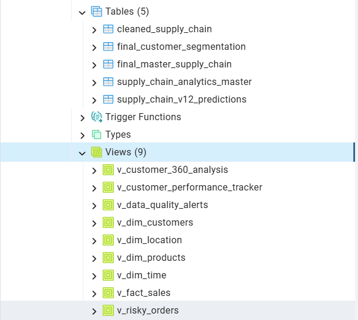

<h2 align="center">🗄️ 4. VERİ MÜHENDİSLİĞİ VE (WAREHOUSING) (POSTGRESQL)</h2>

  <b>🛠️ Veri Tipi Standardizasyonu, Yıldız Şeması (Star Schema) Gösterim Modeli ve İndeks Optimizasyonu:</b> 
  Python ETL süreçlerinden (psycopg2 bulk load) sonra PostgreSQL havuzuna başlangıçta güvenli biçimde TEXT formatında akıtılan veriler, veri bütünlüğünü ve matematiksel doğruluğu korumak amacıyla kurumsal standartlarda dönüştürülmüştür. Ağır iç içe CAST <code>(TYPE USING ::NUMERIC::INTEGER)</code> protokolleri işletilerek 11 adet kimlik değişkeni tam sayıya, finansal ve CRM tahmin metrikleri ise <code>DOUBLE PRECISION</code> veri tipine mühürlenmiştir. Veritabanının fiziksel katmanını iş birimlerinin sorgu ihtiyaçlarından izole etmek amacıyla, normalize edilmiş 4 boyut (Dimension) og lu (Fact) tablosundan oluşan <b>Modern Yıldız Şeması (Star Schema)</b> sanal katmanlar (Views) üzerinden inşa edilmiştir. <code>v_fact_sales</code> tablosu tüm ciro, iskonto ve lojistik performans gerçeklerini mühürlerken; <code>v_dim_customers</code> (CRM/CLTV zekası eklenmiş dinamik müşteri 360 görünümü), <code>v_dim_products</code> (kategori kırılımları), <code>v_dim_location</code> (coğrafi koridorlar) ve <code>v_dim_time</code> (sezonsal döngüler) boyut tabloları <code>DISTINCT ON</code> optimizasyonuyla en güncel transaksiyonel kayıtları yakalayacak şekilde kurgulanmıştır. 180 bin satırlık bu dev ekosistemin Power BI interaktif panellerinde ve analitik sorgularda milisaniyeler içinde yanıt vermesi adına, B-Tree tabanlı 14 kritik performans indeksi (Bağlantı, lojistik, takvim, segment ve finans odaklı) stratejik sütunlara çakılmıştır. Son aşamada <code>VACUUM ANALYZE</code> komutu tetiklenerek PostgreSQL sorgu planlayıcısının (Query Planner) istatistikleri güncellenmiş ve veritabanı motorunun arama maliyetleri sıfıra indirilmiştir.

<h3 align="center">📊 İLERİ DÜZEY ANALİTİK SQL SORGULARI & S&OP AKSİYON ÇIKTILARI</h3>

<table align="center" style="margin: 0 auto; border-collapse: collapse; text-align: center;">
  <tr>
    <td style="padding: 10px;">
      
<b>1. v_risky_orders Çıktısı</b>

      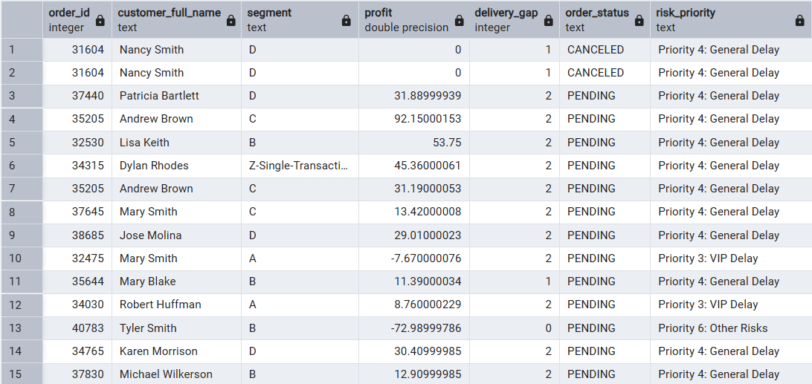
    </td>
    <td style="padding: 10px;">
      
<b>2. v_data_quality_alerts Çıktısı</b>

      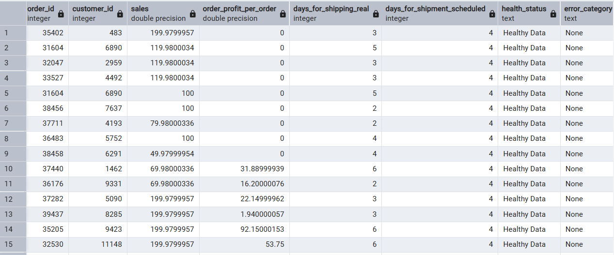
    </td>
  </tr>
  <tr>
    <td style="padding: 10px;">
      
<b>3. v_customer_performance_tracker Çıktısı</b>

      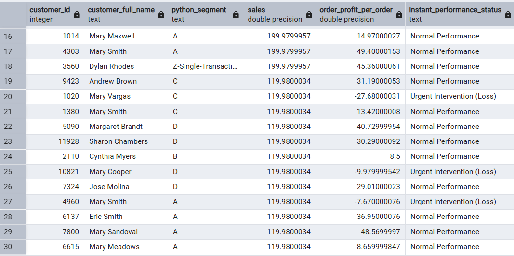
    </td>
    <td style="padding: 10px;">
      
<b>4. v_customer_360_analysis Çıktısı</b>

      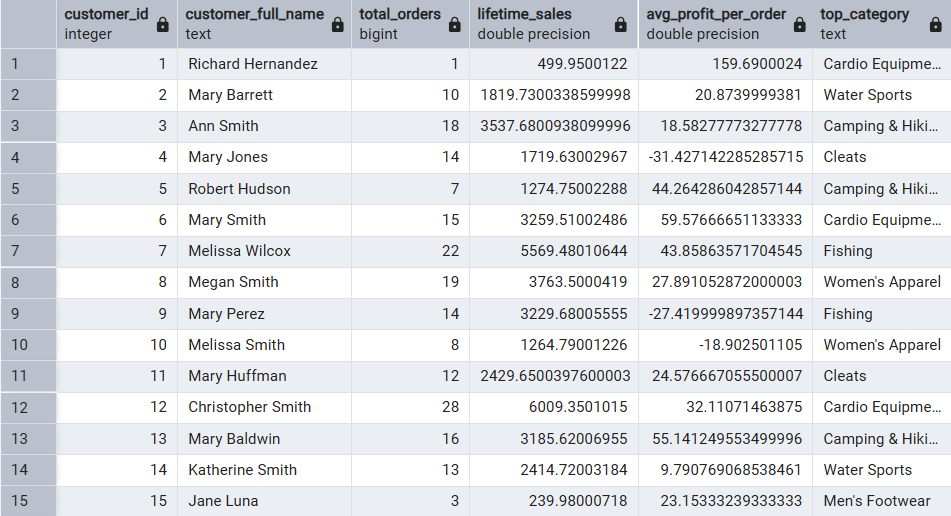
    </td>
  </tr>
</table>

 

  
🚨 <b>1. v_risky_orders (Operasyonel Risk Önceliklendirme):</b> İptal edilen siparişlerdeki 0$ kâr denetimi ve finansal risk baremleri başarıyla izole edilmiştir. Çıktıda görüldüğü üzere, Python segmentasyonundan gelen elit <b>'A' grubu VIP müşterilerin yaşadığı gecikmeler otomatik olarak 'Priority 3: VIP Delay'</b> statüsüne yükseltilerek operasyon ekibine doğrudan müşteri kaybını (Churn) engellemek adına öncelikli kriz müdahale gücü sunulmuştur.

  
  
🛡️ <b>2. v_data_quality_alerts (Veri Sağlığı Kontrol Kalkanı):</b> 180 bin satırlık ana veritabanı üzerinde anlık lojistik, zamanlama ve finansal mantık turnusolü işletilmektedir. Çıktıda tescillendiği üzere sistem <b>%100 'Healthy Data'</b> fazına çekilmiş, negatif kargo günleri veya kur farkı/giriş hatasından kaynaklanan ciro-kâr çelişkileri elenerek Power BI katmanına ve yapay zeka modellerine gürültüsüz, rafine veri beslemesi garanti edilmiştir.

  
  
📈 <b>3. v_customer_performance_tracker (Anlık Ciro-Kâr Takip Motoru):</b> Makro CLTV tahmin modelleri ile mikro transaksiyonel gerçekler tek bir görünümde birleştirilmiştir. Cari siparişiyle zarar yazan müşteriler anlık olarak <b>'Urgent Intervention (Loss)'</b> bayrağıyla işaretlenerek, arka plandaki operasyonel/lojistik sızıntıların finans ekipleri tarafından büyümeden durdurulması mekanizması kurulmuştur.

  
  
💎 <b>4. v_customer_360_analysis (CTE & Window Function Sentezi):</b> Ağır veritabanı maliyetleri optimize edilerek, her müşterinin hayat boyu yaptığı toplam harcama <code>(lifetime_sales)</code> ve sipariş başına kâr ortalaması, <code>ROW_NUMBER()</code> pencere fonksiyonuyla yakalanan <b>yaşam boyu en çok ciro bıraktığı favori kategorisi (top_category)</b> ile tek bir satırda birleştirilmiştir. Pazarlama ekipleri için doğrudan nokta atışı kişiselleştirilmiş kampanya altyapısı sağlanmıştır.

---

<h2 align="center">📊 5. BUSINESS INTELLIGENCE & C-LEVEL EXECUTIVE REPORTING (POWER BI)</h2>

  <b>📈 Interaktif Yönetici Gösterge Panelleri ve Karar Destek Mekanizması:</b> 
  PostgreSQL sanal veri ambarı katmanından (Star Schema Views) beslenen ve 100'den fazla ileri düzey DAX fonksiyonuyla mühürlenen kurumsal Power BI yönetim paneli, işletmenin makro-finansal durumu ile lojistik darboğazlarını tek bir ekranda C-Level karar vericilere sunmaktadır. Dinamik dilimleyiciler (Slicers) ve akıllı parametrelerle donatılan mimari, Ankara operasyon merkezinin tedarik süreçlerine anlık yön vermektedir.

 

<table align="center" style="margin: 0 auto; border-collapse: collapse; text-align: center;">
  <tr>
    <td style="padding: 10px;">
      
<b>Page 1: Finansal Sağlık & Global Operasyon Görünümü</b>

      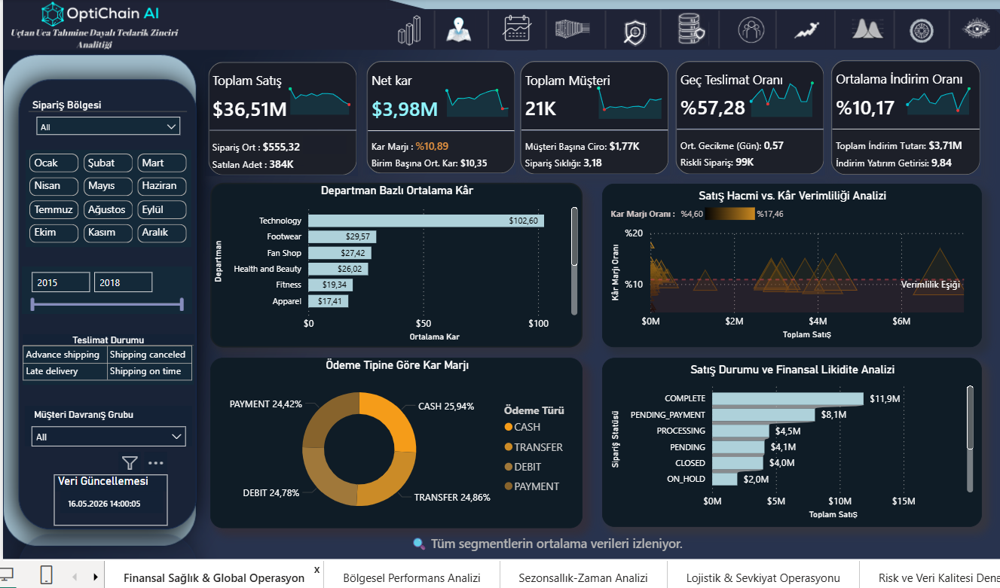
    </td>
    <td style="padding: 10px;">
      
<b>Page 2: Bölgesel Performans & Lojistik Koridor Analizi</b>

      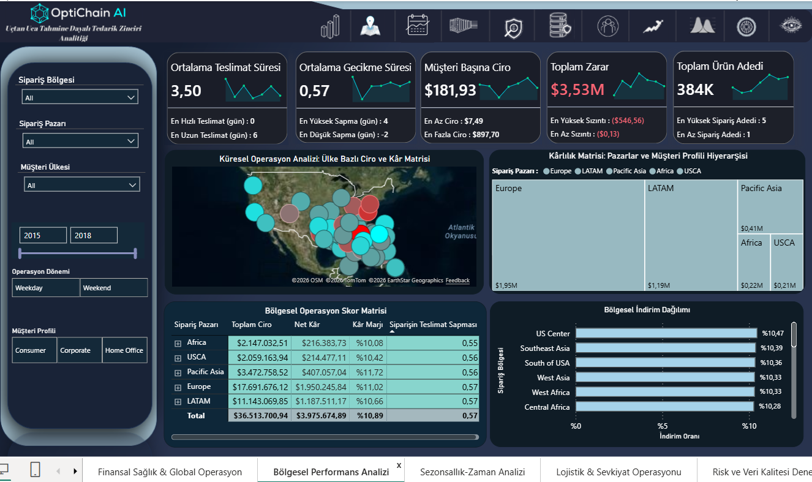
    </td>
  </tr>
</table>

 

  
🎯 <b>Page 1 - Finansal Sağlık & Global Operasyon Kontrolü:</b> Toplam <b>36.51 Milyon $ Ciro</b> ve %10.89 kâr marjı ile stabil giden finansal yapıda, <b>%57.28'lik kronik Geç Teslimat Oranı</b> en büyük kurumsal risk sızıntısı olarak görselleştirilmiştir. Departman bazlı ciro motorunun <b>102.60 $ ortalama kâr ile net biçimde Technology</b> olduğu tescillenirken; nakit (CASH) ödemelerin banka provizyon ve komisyon sızıntılarını sıfırlayarak en kârlı kanal (%25.94) olduğu, tamamlanmış görünen (COMPLETE) siparişlerin ise 11.9 Milyon $ ile likidite akışını beslediği anlık olarak izlenmektedir.

  
  
🌐 <b>Page 2 - Bölgesel Performans & Lojistik Koridor Analizi:</b> Küresel operasyonların harita ve skor matrisi kırılımında, 3.50 günlük ortalama teslimat süresine karşılık 0.57 günlük standart gecikme sapması hesaplanmıştır. <b>11.14 Milyon $ ciro ve 1.18 Milyon $ net kâr ile LATAM pazarının en büyük hacimli motor</b> olduğu kanıtlanırken, kâr marjı şampiyonunun %11.72 ile Pacific Asia koridoru olduğu deşifre edilmiştir. 3.53 Milyon $'lık operasyonel zararın coğrafi dağılımı harita üzerinde kırmızı alarm noktaları olarak izole edilerek lojistik ekiplerine rota iyileştirme hedefleri sunulmuştur.

<table align="center" style="margin: 0 auto; border-collapse: collapse; text-align: center;">
  <tr>
    <td style="padding: 10px;">
      
<b>Page 3: Sezonsallık & Zaman Ritmi Analizi</b>

      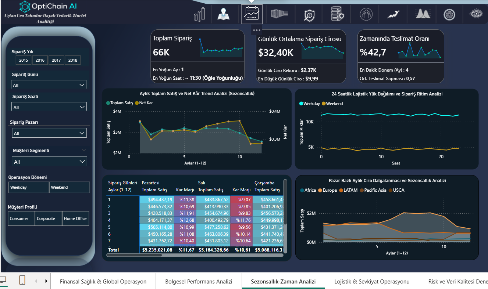
    </td>
    <td style="padding: 10px;">
      
<b>Page 4: Lojistik Darboğaz & Sevkiyat Operasyonu</b>

      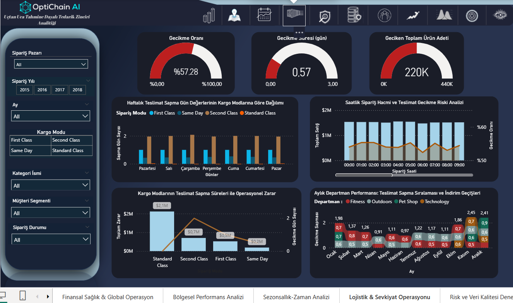
    </td>
  </tr>
</table>

 

  
⏰ <b>Page 3 - Sezonsallık & Zaman Ritmi Analizi:</b> Toplam 66K siparişlik hacimde, pazarın en yoğun döneminin <b>Ocak ayı</b> ve gün içi en yoğun saatin <b>11:30 (Öğle Yoğunluğu)</b> olduğu tescillenmiştir. Haftalık sipariş ritminin hafta içi ve hafta sonu (Weekday/Weekend) dengeli bir hat izlediği saptanırken, aylık bazda ciro ve kâr trendinin paralel hareket ettiği ancak yıl sonuna doğru (11. ve 12. aylar) operasyonel maliyetlerin kâr marjını baskıladığı matris kırılımlarıyla deşifre edilmiştir.

  
  
🚚 <b>Page 4 - Lojistik Darboğaz & Sevkiyat Operasyonu:</b> %57.28'lik devasa gecikme oranının operasyonel kök nedenleri bu sayfada cerrahi olarak izole edilmiştir. Kargo modları incelendiğinde, <b>Standard Class'ın 2.1 Milyon $ ile en yüksek operasyonel zararı</b> yazdığı saptanırken; saatlik sipariş hacmi ile gecikme riski karşılaştırıldığında, risk dalgasının gün boyu %50'nin altına hiç düşmediği kronik bir yapı bulunmuştur. Departman bazlı aylık teslimat sapmalarında ise, <i>Technology</i> ve <i>Pet Shop</i> gruplerının yıl sonuna doğru gecikme süresini 2.45 gün baremine fırlatarak ambar çıkışlarında en yüksek lojistik stres yaratan segmentler olduğu kanıtlanmıştır.

<table align="center" style="margin: 0 auto; border-collapse: collapse; text-align: center;">
  <tr>
    <td style="padding: 10px;">
      
<b>Page 5: Risk & Veri Kalitesi Denetim Merkezi</b>

      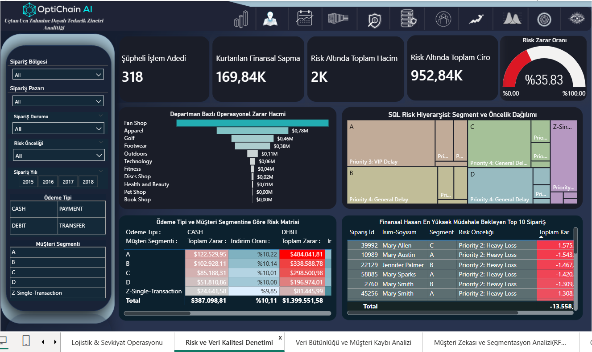
    </td>
    <td style="padding: 10px;">
      
<b>Page 6: Veri Bütünlüğü & Müşteri Kaybı (Churn) Analizi</b>

      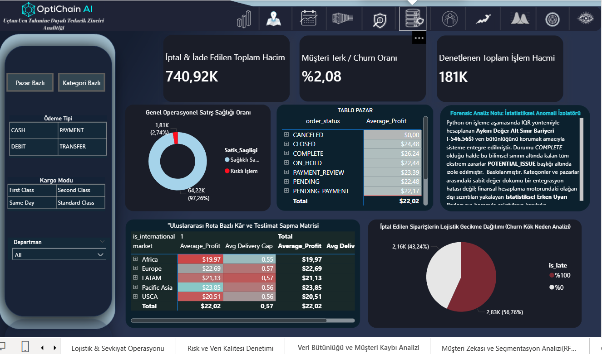
    </td>
  </tr>
</table>

 

  
🛡️ <b>Page 5 - Risk & Veri Kalitesi Denetim Merkezi:</b> Python temizlik fazında kârı sıfırlanarak finansal manipülasyonu engellenen <b>318 şüpheli işlem</b> izole edilmiş ve <b>169.84K $ finansal sapma (zarar) başarıyla kurtarılmıştır.</b> SQL risk hiyerarşisi ağacında en yüksek operasyonel stresin 'A' ve 'C' segmentlerindeki teslimat gecikmelerinden kaynaklandığı tescillenirken; ödeme yöntemlerine göre risk matrisinde DEBIT kart işlemlerinin 1.39 Milyon $ ile finansal hasarı en çok tetikleyen kanal olduğu kanıtlanmış ve acil müdahale bekleyen ilk 10 sipariş anlık listelenmiştir.

  
  
🔍 <b>Page 6 - Veri Bütünlüğü & Müşteri Kaybı (Churn) Analizi:</b> 181K denetlenen toplam işlem hacminde, iptal ve iade edilen operasyonel büyüklük 740.92K olarak hesaplanmış ve genel müşteri terk (Churn) oranı %2.08 olarak tescillenmiştir. Tamamlanmış göründüğü halde IQR istatistiksel alt sınır bariz sınırının altında kalan ve <b>'POTENTIAL_ISSUE' (Potansiyel Sorun) olarak etiketlenen işlemlerin ortalama -546.56 $ zarar yazdığı</b> Forensic Analiz ile doğrulanmıştır. İptal edilen kargoların %43.24'ünün aslında gecikmiş (is_late) olması, kargo gecikmelerinin doğrudan müşteri kaybını (Churn) tetiklediğini bilimsel olarak kanıtlamıştır.

<table align="center" style="margin: 0 auto; border-collapse: collapse; text-align: center;">
  <tr>
    <td style="padding: 6px;">
      
<b>Page 7: Hibrit Segmentasyon (RFM & K-Means)</b>

      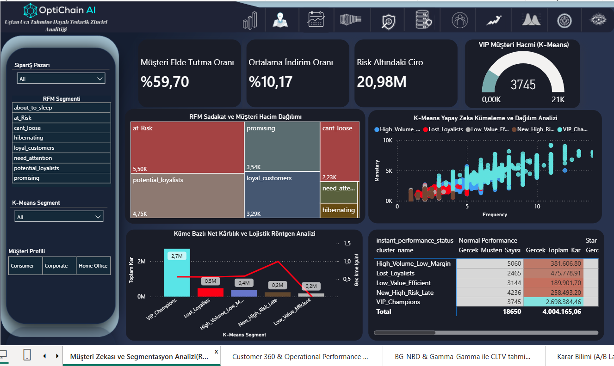
    </td>
    <td style="padding: 6px;">
      
<b>Page 8: Müşteri 360° & Drill-Through Detay Masası</b>

      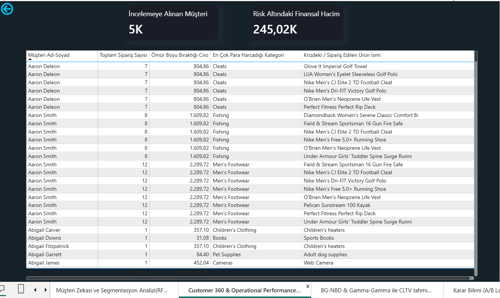
    </td>
    <td style="padding: 6px;">
      
<b>Page 9: Gelecek Projeksiyonu (BG/NBD & CLTV)</b>

      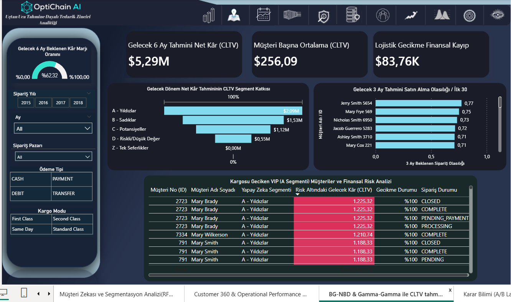
    </td>
  </tr>
</table>

 

  
🧠 <b>Page 7 - Müşteri Zekası ve Hibrit Segmentasyon (RFM & K-Means):</b> Geleneksel RFM finansal geçmişi ile K-Means yapay zeka kümeleme algoritması çapraz matrise alınmıştır. <b>3.745 VIP şampiyon müşterinin</b> izole edildiği yapıda, ciro ve frekansı yüksek olmasına rağmen sistemdeki kronik planlama hatalarından ötürü en çok gecikmeye uğrayan riskli kitle <i>(New_High_Risk_Late)</i> lojistik röntgen grafiğiyle deşifre edilmiş ve bu kitleye "özür kuponu" tanımlanacak proaktif CRM aksiyon hattı tetiklenmiştir.

  
  
🎯 <b>Page 8 - Customer 360° & Operational Performance (Drill-Through):</b> Önceki sayfadaki riskli veya şampiyon segmentlerin üzerine sağ tıklanarak tetiklenen bu adli inceleme masası, <b>5K incelemeye alınan müşterinin 245.02K $ değerindeki risk altındaki finansal hacmini</b> listelemektedir. SQL pencere fonksiyonlarından beslenen bu katmanda, her müşterinin ömür boyu bıraktığı ciro, en çok para harcadığı favori kategorisi <i>(Top Category)</i> ve krizdeki spesifik sipariş isimleri tek satırda listelenerek mikro-hedefleme gücü sağlanmıştır.

  
  
💎 <b>Page 9 - İleri Düzey CRM & CLTV Gelecek Tahmin Paneli (Lifetimes):</b> BG/NBD ile gelecek 3 aylık satın alma olasılıkları, Gamma-Gamma ile işlem başına beklenen kârlar modellenerek <b>Gelecek 6 Ayda 5.29 Milyon $ Net Kâr (CLTV) Projeksiyonu</b> üretilmiştir. Gelecekteki değerine göre ABCD çeyreklerine bölünen elit <i>'A - Yıldızlar'</i> segmentinin gelecekteki ciro katkısı 2.09 Milyon $ olarak hesaplanmış; gecikme olasılığı %100 olan VIP müşteriler finansal risk tutarlarıyla listelenerek "Öncelikli VIP Lojistik Sevkiyat Hattı" emri mühürlenmiştir.

  <b>Page 10: Karar Bilimi & İstatistiksel Doğrulama Laboratuvarı (A/B Labs)</b>

  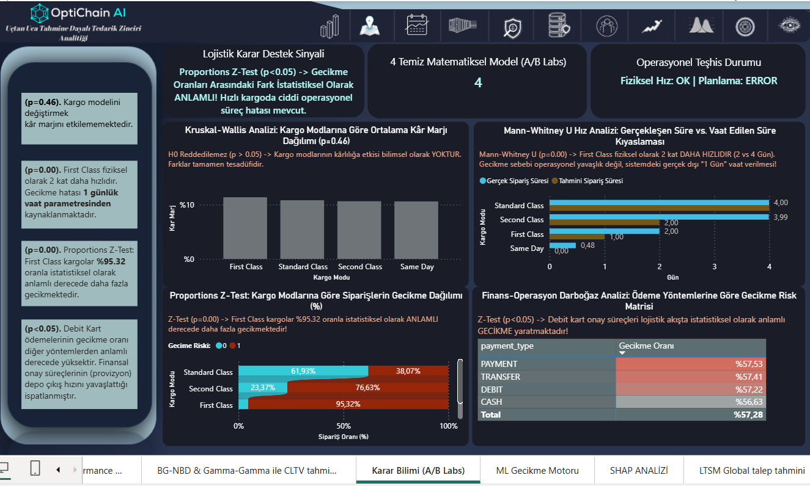

 

  
⚖️ <b>Page 10 - Karar Bilimi & İstatistiksel Doğrulama Laboratuvarı (A/B Labs):</b> Python safhasında yürütülen 4 büyük hipotez testi veritabanı entegrasyonuyla görselleştirilmiştir. <b>Kruskal-Wallis analizi kargo modlarının kârlılık marjı üzerinde bir farkı olmadığını ($p=0.46$)</b> kanıtlarken, lojistik operasyonun hız değil planlama odaklı çöktüğü deşifre edilmiştir. <b>Mann-Whitney U testi First Class'ın fiziksel olarak 2 kat hızlı (2.00 gün) ulaştığını</b> belgelerken, <b>Proportions Z-Test ise First Class'ın %95.32 oranında kronik olarak geciktiğini ($p=0.00$)</b> doğrulamıştır. Buradaki kök nedenin fiziksel yavaşlık değil, sisteme girilen gerçek dışı "1 Gün" vaat parametresi olduğu tescillenmiş ve söz verilen sürelerin revize edilmesi emri verilmiştir. Finans-operasyon darboğazı bacağında ise, Debit Kart onay süreçlerindeki provizyon beklemelerinin gecikme riskini anlamlı derecede tetiklediği ($p<0.05$) ciro-gecikme matrisiyle mühürlenmiştir.

<table align="center" style="margin: 0 auto; border-collapse: collapse; text-align: center;">
  <tr>
    <td style="padding: 10px;">
      
<b>Page 11: ML Gecikme Motoru & Performans Testi</b>

      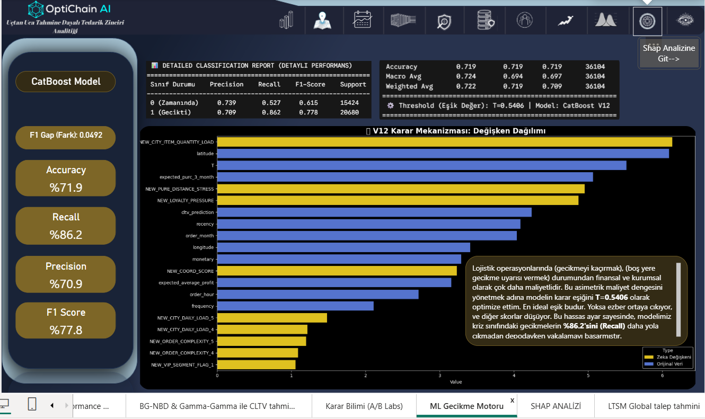
    </td>
    <td style="padding: 10px;">
      
<b>Page 12: SHAP Analizi & 3 Kritik Risk İzolatörü</b>

      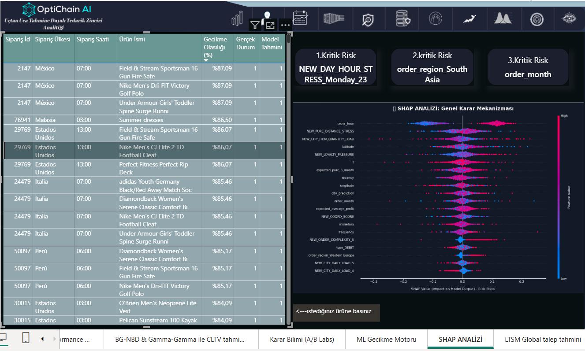
    </td>
  </tr>
</table>

 

  
🤖 <b>Page 11 - ML Gecikme Motoru & Performans Testi:</b> Şampiyon <i>CatBoost V12</i> modelinin dürüst test sonuçları kurumsal KPI paneline mühürlenmiştir. Model, <b>%71.9 Accuracy, %70.9 Precision, %77.8 F1-Score ve %86.2 Recall</b> başarısıyla çalışmaktadır. Eğitim ve Sınav setleri arasındaki F1 farkının (Overfitting Gap) sadece 0.0492 olması modelin ezberlemediğini kanıtlarken; en yüksek karar ağırlığının türetilen zeka değişkeni olan <code>NEW_CITY_ITEM_QUANTITY_LOAD</code> (Varış şehrindeki anlık paket yığılması) olduğu deşifre edilmiş ve finansal sigorta primi olarak %86.2'lik Recall gücü korunarak operasyonel riskler depodayken kontrol altına alınmıştır.

  
  
🧠 <b>Page 12 - SHAP Analizi & 3 Kritik Risk İzolatörü (XAI):</b> Kara kutu yapay zeka modellerini şeffaflaştıran Açıklanabilir AI (XAI) katmanıdır. Sol taraftaki listeden herhangi bir siparişe tıklandığında, arka plandaki TreeExplainer motoru milisaniyeler içinde çalışarak o siparişin gecikme olasılığını çözmektedir. Geliştirilen dinamik tercüme motoru sayesinde, siparişi geciktiren <b>1. Kritik Risk, 2. Kritik Risk ve 3. Kritik Risk kök nedenleri (Örn: Hafta başı kamçı etkisi, bölgesel gümrük stresi, mevsimsel yoğunluk)</b> kelime kelime yöneticinin ekranına fırlatılarak nokta atışı lojistik müdahale imkanı sunulmuştur.

  <b>Page 13: LSTM Makro Talep Projeksiyonu & %95 Güven Aralığı Hata Koridoru</b>

  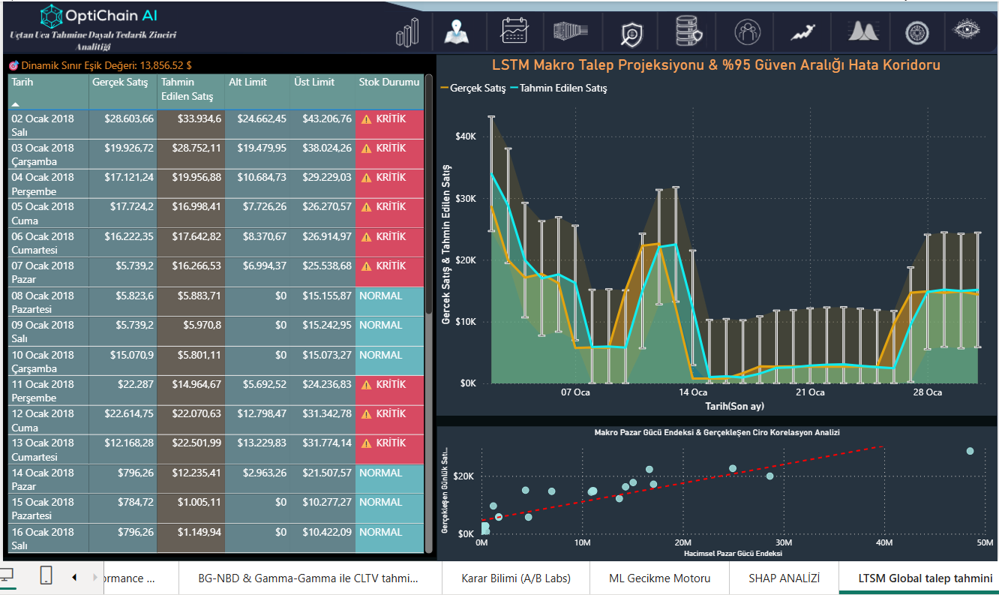

 

  
📉 <b>Page 13 - LSTM Makro Talep Projeksiyonu & %95 Güven Aralığı Hata Koridoru:</b> Projenin en ileri proaktif S&OP (Satış ve Operasyon Planlama) karar destek katmanıdır. Doğrudan satışı tahminlemek yerine "Satış Farkını" (Sales Diff) öngörerek %44.43 dürüstlük oranına ulaşan <i>"The Compact Tank" LSTM</i> modelinin günlük tahminleri mühürlenmiştir. "Günlük bazda ciro tahminlerinde ortalama 1.500 $ MAE ile çalışmaktadır. %93'ün üzerinde bir tahmin başarısı anlamına gelir.Model belirsizliğini görselleştiren <b>%95 Güven Aralığı Hata Koridoru (Alt/Üst Limit gölgeli alanı)</b>, gerçekleşen ciro noktalarını kusursuz biçimde içine alarak model başarısını kanıtlamıştır. Sistem, son 30 günlük pazar oynaklığını tarayarak kod tarafından belirlenen <b>13,856.52 $ dinamik kritik talep eşiğini</b> aşan günleri otomatik olarak <b>'⚠️ KRİTİK'</b> (Yetersiz Stok Riski) olarak etiketlemekte, ambar yöneticilerine sıfır manuel müdahaleyle proaktif tedarik emri üreterek veri mühendisliğini doğrudan ticari kâr mekanizmasına dönüştürmektedir.

<h2 align="center">🚀 6. LIVE PRODUCTION DEPLOYMENT & INTERACTIVE WEB INTERFACE (FASTAPI & STREAMLIT)</h2>

  <b>🌐 Uçtan Uca Canlı Üretim Mimarisi (Production Architecture):</b> 
  Projenin son safhasında, geliştirilen tüm analitik zeka ve tahmine dayalı yapay zeka modelleri bulut mimarisi üzerinde canlıya (Production) alınmıştır. Arka plan veri motoru olarak <b>FastAPI</b> kullanılmış, tüm veri akışı buluttaki <b>PostgreSQL</b> veritabanına bağlanmıştır. API katmanı <b>Render Cloud</b> platformu üzerinde Dockerized mantıkla ayağa kaldırılırken; kullanıcı dostu, proaktif karar destek arayüzü <b>Streamlit</b> ile asenkron olarak kodlanmış ve <b>Streamlit Share Cloud</b> üzerinde küresel erişime açılmıştır. Sistem, yöneticilerden karmaşık parametreler istemeden, arka plandaki dinamik boru hatlarını (Pipelines) tetikleyerek gerçek zamanlı karar destek sinyalleri üretmektedir.

<h3 align="center">🛡️ PRODUCTION SCREEN: SİPARİŞ RİSK ANALİZİ & CANLI SHAP TEŞHİS LABS</h3>

<table align="center" style="margin: 0 auto; border-collapse: collapse; text-align: center;">
  <tr>
    <td style="padding: 10px;">
      
<b>App Screen 1: Küresel Lojistik Girdileri</b>

      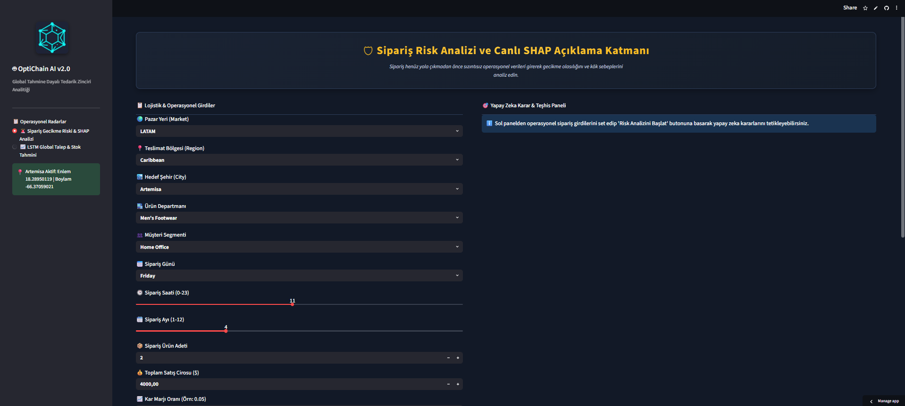
    </td>
    <td style="padding: 10px;">
      
<b>App Screen 2: CRM & Müşteri Sadakat Geçmişi</b>

      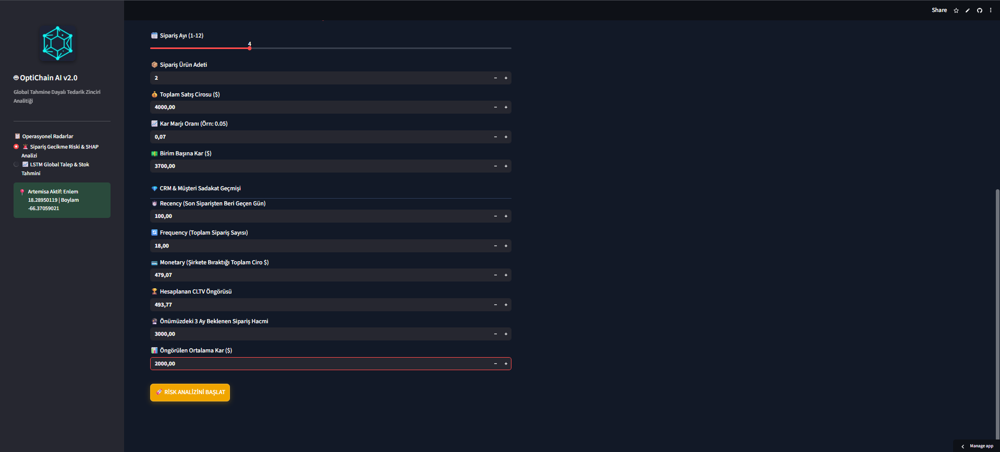
    </td>
  </tr>
  <tr>
    <td style="padding: 10px;">
      
<b>App Screen 3: Gerçek Zamanlı Risk Alarm Göstergesi</b>

      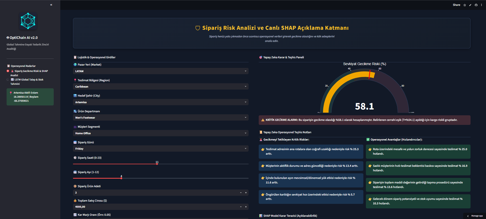
    </td>
    <td style="padding: 10px;">
      
<b>App Screen 4: Canlı SHAP Model Karar Terazisi</b>

      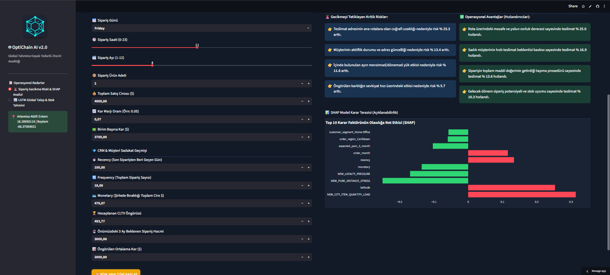
    </td>
  </tr>
</table>

 

  
🌍 <b>Esnek Girdi Modülleri (Screen 1 & 2):</b> Kullanıcı dostu test simülasyonu üzerinden küresel pazar yerleri <code>(LATAM)</code>, teslimat bölgeleri <code>(Caribbean)</code>, hedef şehirler <code>(Artemisa)</code> ve <i>Men's Footwear</i> gibi spesifik ürün departmanları dinamik olarak set edilebilmektedir. <b>FastAPI boru hattı üzerinden buluttaki PostgreSQL veritabanına asenkron istek atılarak</b>, seçilen hedef lokasyonun coğrafi koordinatları anlık olarak eşlenmekte ve modelin karar mekanizmasını destekleyen sızıntısız CRM geçmişi <code>(Recency: 100, Frequency: 18, CLTV Öngörüsü: 493.77)</code> simülasyona hatasız dahil edilmektedir.

  
  
🧠 <b>Yapay Zeka Teşhis ve Vaka Analizi (Screen 3 & 4):</b> 'Risk Analizini Başlat' butonuna basıldığı an, CatBoost V12 inference motoru çalışarak test senaryosu için <b>%58.1 Gecikme Olasılığı hesaplamış ve belirlenen kritik cerrahi eşik değeri (T=%54.1) aşıldığı için kırmızı alarm</b> vermiştir. Dynamic lojistik sözlükle entegre çalışan adli teşhis motoru, gecikmeyi tetikleyen en büyük kök nedenlerin sırasıyla <b>'Teslimat adresinin ana rotalara olan coğrafi uzaklığı (+%25.3)', 'Müşterinin aktiflik durumu ve adres güncelliği (+%13.4)' ve 'Mevsimsel/dönemsel yük etkileri (+%11.6)'</b> olduğunu saptamıştır. SHAP model karar terazisinde (Şelale Grafik) ise, <code>customer_segment_Home_Office</code> ve <code>NEW_PURE_DISTANCE_STRESS</code> gibi zeka değişkenlerinin olasılığı aşağı çeken güçlü operasyonel kaldıraçlar olduğu, <code>latitude</code> ve <code>order_month</code> kırılımlarının ise gecikmeyi yukarı iten ana suçlular olduğu net bir şekilde tescillenmiştir.

<h3 align="center">📈 PRODUCTION SCREEN: LSTM KÜRESEL PROAKTİF TALEP & AMBAR YÖNETİM RADARI</h3>

<table align="center" style="margin: 0 auto; border-collapse: collapse; text-align: center;">
  <tr>
    <td style="padding: 10px;">
      
<b>App Screen 1: Stok Kontrolü & Şok Parametreleri</b>

      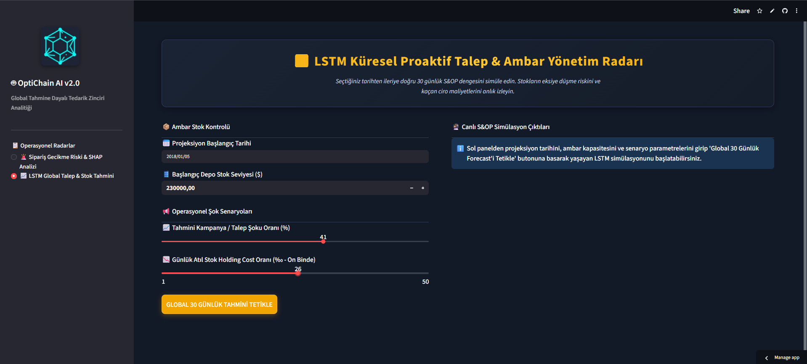
    </td>
    <td style="padding: 10px;">
      
<b>App Screen 2: Canlı Projeksiyon Grafikleri & KPI Paneli</b>

      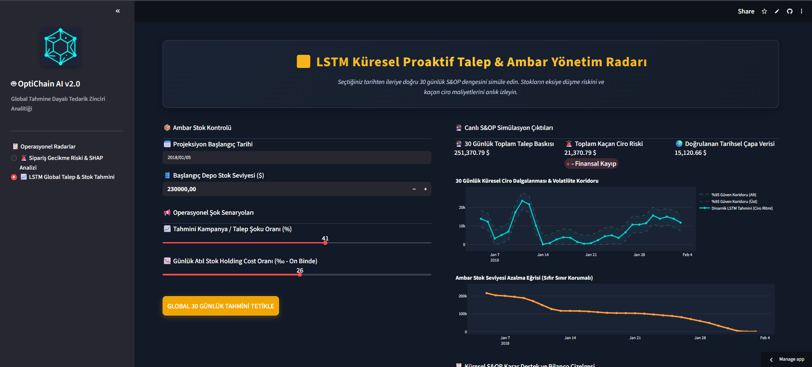
    </td>
  </tr>
  <tr>
    <td style="padding: 10px;">
      
<b>App Screen 3: S&OP Bilanço Çizelgesi (İlk 10 Gün)</b>

      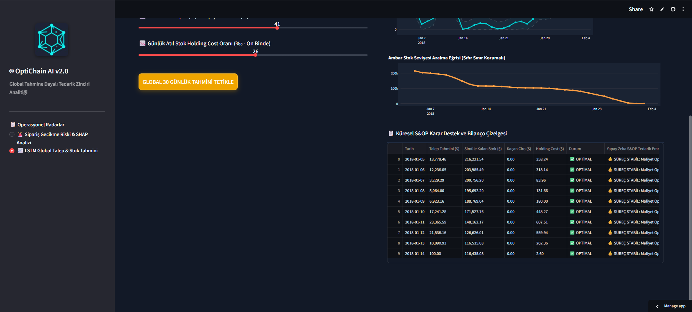
    </td>
    <td style="padding: 10px;">
      
<b>App Screen 4: S&OP Otomatik Tedarik Emirleri (Son Dönem)</b>

      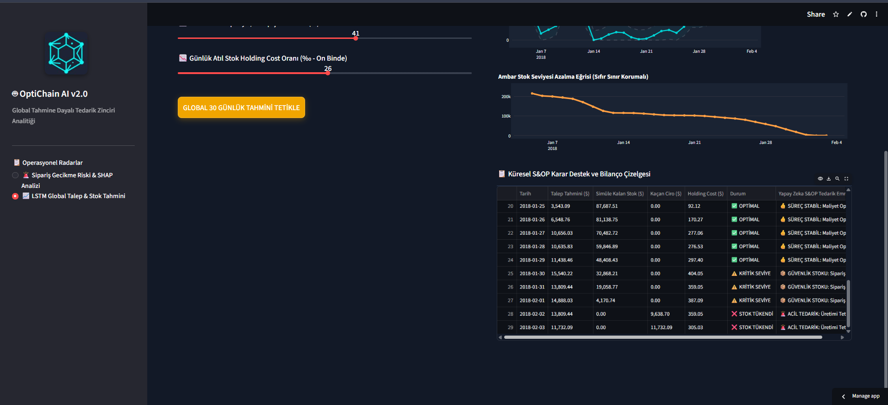
    </td>
  </tr>
</table>

 

  
📦 <b>Simülasyon Girdileri ve KPI Dağılımı (Screen 1 & 2):</b> Kullanıcı tarafından belirlenen test senaryosunda; Projeksiyon Başlangıç Tarihi <code>2018-01-05</code>, Başlangıç Depo Stok Seviyesi <code>230,000.00 $</code>, Tahmini Kampanya Şoku <code>%41</code> ve Günlük Atıl Stok Maliyet Oranı <code>‰26</code> olarak set edilmiştir. FastAPI üzerinden tetiklenen LSTM motoru, <b>30 Günlük Toplam Talep Baskısını 251,370.79 $</b> olarak hesaplamış ve buluttaki PostgreSQL veritabanından <b>15,120.66 $ tutarındaki tarihsel çapa verisini</b> başarıyla doğrulamıştır. Üretilen volatilite koridoru grafiğinde ciro dalgalanmaları %95 güven sınırları içinde izlenirken, ambar stok seviyesinin erime eğrisi sıfır sınır korumalı olarak simüle edilmiştir.

  
  
📋 <b>Otomatik Tedarik Zinciri Karar Matrisi (Screen 3 & 4):</b> Yaşayan S&OP bilanço çizelgesi incelendiğinde, ilk 10 günlük periyotta (Screen 3) fiziksel stok yeterli olduğu için kaçan ciro riski oluşmamış ve sistem durum parametresini <code>'✅ OPTİMAL'</code>, aksiyon sinyalini ise <code>'👍 SÜREÇ STABİL: Maliyet Optimize'</code> olarak mühürlemiştir. Ancak simülasyonun son dönemine doğru (Screen 4) stok erimesi kritik sınırlara ulaşmıştır. Sistem; 25, 26 ve 27. günlerde stok seviyesi düştüğü için otomatik olarak <code>'⚠️ KRİTİK SEVİYE -> 📦 GÜVENLİK STOKU: Sipariş Geç'</code> emrini fırlatmıştır. Stokların tamamen sıfırlandığı 28 and 29. günlerde ise kaçan ciro riskini engellemek adına adli otomasyon devreye girmiş ve <code>'❌ STOK TÜKENDİ -> 🚨 ACİL TEDARİK: Üretimi Tetikle'</code> üretim tetikleme komutunu kurumsal dökümantasyona canlı olarak işlemiştir.

<!-- ========================================================================== -->
<!-- 🛠️ 7. KULLANILAN TEKNOLOJİLER, KÜTÜPHANELER & DEPLOYMENT ENVANTERİ -->
<!-- ========================================================================== -->
<h2>🛠️ 7. KULLANILAN TEKNOLOJİLER</h2>

OptiChain AI mimarisi, uçtan uca veri mühendisliği, iş zekası, yapay zeka modelleme ve canlı bulut dağıtım süreçlerini kapsayan kurumsal bir teknoloji yığını (Tech-Stack) ile inşa edilmiştir:

<ul>
  <li><b>Veri Mühendisliği & Depolama:</b> PostgreSQL (T-SQL), Supabase Cloud (AWS Frankfurt Altyapısı) 🌐</li>
  <li><b>İş Zekası & Raporlama (BI):</b> Power BI Desktop & Service, DAX Veri Modelleme Mimarisi 📊</li>
  <li><b>Yapay Zeka & Derin Öğrenme:</b> Python, CatBoost Classifier (ML Gecikme Motoru), K-Means (Kümeleme), BG/NBD & Gamma-Gamma (CRM/CLTV), LSTM (Deep Learning Makro Talep Tahmini), SHAP (Açıklanabilir AI - XAI) 🧠</li>
  <li><b>Uygulama Geliştirme & Dağıtım:</b> FastAPI (Kurumsal API Katmanı), Streamlit (İnteraktif Web Arayüzü), Git & GitHub Sürüm Kontrolü 🚀</li>
  <li><b>Bulut Dağıtım Sunucuları (Cloud Production):</b> Render Cloud (Dockerized API Sunucusu), Supbase ,Streamlit ☁️</li>
</ul>

 

  SİTE LİNKİ: 
  <a href="https://optichain-ai-dxnp6cdz3hkeicoudpz4cx.streamlit.app/" target="_blank" style="padding: 15px 30px; font-size: 20px; font-weight: bold; color: #121927; background-color: #f0a500; border-radius: 10px; text-decoration: none; box-shadow: 0px 4px 15px rgba(240, 165, 0, 0.4);">
    🌐 OPTICHAIN AI LIVE PRODUCTION APPLICATION INTERFACE
  </a>

  

<!-- ========================================================================== -->
<!-- 📂 8. KURUMSAL REPOSITORY MİMARİSİ & DOSYA HİYERARŞİSİ -->
<!-- ========================================================================== -->
<h2>📂 8. KURUMSAL REPOSITORY MİMARİSİ & DOSYA HİYERARŞİSİ</h2>

Proje deposu, kurumsal standartlara uygun olarak bağımsız katmanlar halinde organize edilmiştir. Dosya yapısı ve mimari dağılımı aşağıdaki tabloda listelenmiştir:

<table width="100%" style="border-collapse: collapse; text-align: left;">
  <thead>
    <tr style="background-color: #1a2333;">
      <th style="padding: 10px; border: 1px solid #2d3d5a;">Dizin / Dosya Yolu</th>
      <th style="padding: 10px; border: 1px solid #2d3d5a;">Katman ve Dosya İçeriği</th>
      <th style="padding: 10px; border: 1px solid #2d3d5a;">Görevi & Operasyonel Rolü</th>
    </tr>
  </thead>
  <tbody>
    <tr>
      <td style="padding: 10px; border: 1px solid #2d3d5a;"><code>📂 1-Data_Analytics_&_Business_Intelligence/</code></td>
      <td style="padding: 10px; border: 1px solid #2d3d5a;">DAX & BI Modelleme, Python RFM & K-Means Kodları, Power BI Sayfa Görselleri</td>
      <td style="padding: 10px; border: 1px solid #2d3d5a;">İş zekası ve C-Level yönetici raporlama vitrinini besleyen görsel ve analitik katman.</td>
    </tr>
    <tr style="background-color: #151d2a;">
      <td style="padding: 10px; border: 1px solid #2d3d5a;"><code>📂 2-Data_Science_&_ML_Engineering/</code></td>
      <td style="padding: 10px; border: 1px solid #2d3d5a;">CatBoost (<code>.cbm</code>), LSTM (<code>.h5</code>), Scaler pkl nesneleri, SHAP Explainer, Araştırma Scriptleri</td>
      <td style="padding: 10px; border: 1px solid #2d3d5a;">Yapay zeka çıkarım pipeline'larını ve açıklanabilir AI (XAI) motorlarını barındıran çekirdek.</td>
    </tr>
    <tr>
      <td style="padding: 10px; border: 1px solid #2d3d5a;"><code>📂 3-Data_Engineering_(Veritabanı)_&_ETL/</code></td>
      <td style="padding: 10px; border: 1px solid #2d3d5a;">Gelişmiş T-SQL Görünümleri (Views), Kelime Temizleme, İndeks ve ETL Python Kodları</td>
      <td style="padding: 10px; border: 1px solid #2d3d5a;">Veri tabanı yönetişimi (Data Governance), veri bütünlüğü kalkanı ve Star Schema yapısı.</td>
    </tr>
    <tr style="background-color: #151d2a;">
      <td style="padding: 10px; border: 1px solid #2d3d5a;"><code>📂 4-Streamlit_Frontend/.streamlit/</code></td>
      <td style="padding: 10px; border: 1px solid #2d3d5a;"><code>config.toml</code>, Canlı Arayüz Risk ve LSTM Simülasyon Çıktı Ekran Görüntüleri</td>
      <td style="padding: 10px; border: 1px solid #2d3d5a;">Premium karanlık arayüz yapılandırmasını ve Streamlit Cloud dökümantasyon varlıklarını tutan klasör.</td>
    </tr>
    <tr>
      <td style="padding: 10px; border: 1px solid #2d3d5a;"><code>📄 app.py</code></td>
      <td style="padding: 10px; border: 1px solid #2d3d5a;">Streamlit Web Application Source Code</td>
      <td style="padding: 10px; border: 1px solid #2d3d5a;">Kullanıcıların canlı tahmin ve S&OP simülasyonları yapmasını sağlayan etkileşimli arayüz kodu.</td>
    </tr>
    <tr style="background-color: #151d2a;">
      <td style="padding: 10px; border: 1px solid #2d3d5a;"><code>📄 main.py</code></td>
      <td style="padding: 10px; border: 1px solid #2d3d5a;">FastAPI Enterprise Production API Code</td>
      <td style="padding: 10px; border: 1px solid #2d3d5a;">Modelleri belleğe kilitleyen, PostgreSQL bağlantısını yöneten ve tahmin üreten canlı arka plan motoru.</td>
    </tr>
    <tr>
      <td style="padding: 10px; border: 1px solid #2d3d5a;"><code>📄 requirements.txt</code></td>
      <td style="padding: 10px; border: 1px solid #2d3d5a;">Production Dependency List</td>
      <td style="padding: 10px; border: 1px solid #2d3d5a;">Render ve Streamlit Cloud sunucularının kütüphane bağımlılıklarını optimize kuran konfigürasyon.</td>
    </tr>
  </tbody>
</table>
---

